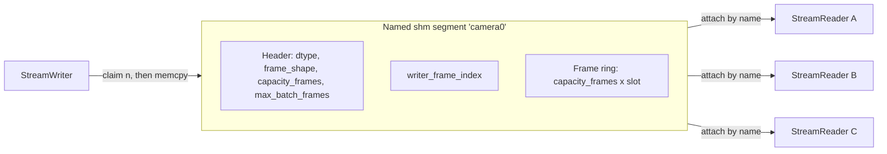

## Handoff

**Read this first** when continuing work in a new chat. Full design spec is in the sections below; this section covers process and current state only.

### Branch methodology

- **One `feat/*` branch per todo** in the frontmatter above. Do not implement multiple todos in one branch.
- **Branch from the latest merged work on `main`**, or from the tip of the previous feature branch if not yet merged (stack: `feat/scaffold` → `feat/ci` → …).
- **One focused commit per branch** (occasionally two if tightly coupled). Propose the diff and commit message; **wait for user sign-off before committing** unless they explicitly say to commit and push.
- **Do not edit this plan file** unless the user asks (except updating todo status in frontmatter when completing a step).
- **Run locally before committing:** `uv sync --group dev`, `uv run ruff check src tests`, `uv run ruff format --check src tests`, `uv run pytest --cov=arraystream`.

### Current state (as of last session)

| Branch | Status | Notes |
|--------|--------|-------|
| `feat/scaffold` | merged or ready | `783f551` — pyproject, uv.lock, src layout, minimal import test |
| `feat/ci` | merged or ready | `d46df21` — `.github/workflows/ci.yml` (ubuntu + macos) |
| `feat/dummy-ci-test` | merged or ready | `bda11fc` — README tweak to validate CI on merge to `main` |
| `feat/header` | **ready** | Not merged — `feat/header` branch |
| `feat/segment` | **next** | Not started |

**Repo:** `https://github.com/acbrown-dev/shared_array_streaming`

**What exists in code today:** scaffold + `header.py` (on `feat/header`). No `segment.py`, `writer.py`, etc. yet.

**Lesson from first attempt:** an earlier session wrote the entire library at once on `feat/scaffold`. That was reset. Stick to one todo per branch.

### Next step

1. Confirm `main` includes scaffold + CI (merge open PRs if needed).
2. `git checkout main && git pull && git checkout -b feat/header`
3. Implement only `header.py` (+ its unit tests). Commit, push, open PR.
4. Mark the `header` todo `completed` in frontmatter when done; proceed to `feat/segment`.

### Plan file location

`.cursor/plans/shared_array_streaming_library_41e1cdd1.plan.md` (in the repo under `.cursor/plans/`).

## Prior art (short version)

Closest existing library is `global-buffer` (single-writer/multi-reader shm ring, zero-copy numpy, attach-by-name). It differs in two ways worth building against: it depends on pydantic/msgspec plus a C extension, and it avoids overrun entirely by allocating `capacity + 1` slots so the writer never overwrites an in-use slot — which stalls the writer for a slow reader instead of dropping. `shm-ring-buffer` and `ipc0cp` are single-consumer or consuming-queue semantics, so neither does many independent readers.

The niche this library fills: **numpy-only dependency, broadcast to N independent readers, batch reads, and an explicit overrun policy rather than writer backpressure.**

## Platform support

**POSIX only in v1 — Linux primary and tested, macOS supported.** Windows is deliberately deferred.

The reason is contract, not effort. Everything here is built on POSIX semantics: the segment outlives the writer process, so readers can attach at any time, detect a crashed writer, drain the tail, and reclaim a stale segment. Windows named mappings are refcounted and vanish when the last handle closes — not worse, but a genuinely different contract, and supporting both would mean either documenting two behaviours or designing to their intersection.

Practical consequences:

- Liveness is `os.kill(writer_pid, 0)`. No ctypes `OpenProcess` shim.
- `list_streams()` scans `/dev/shm` and is Linux-only; documented as such, tests skip on macOS.
- Stream names are validated at `create()` to a maximum of 30 characters. macOS `shm_open` caps names at 31 bytes including the leading slash that `SharedMemory` prepends, and Linux allows far more — enforcing the tighter limit everywhere keeps a stream created on one platform valid on the other.
- Non-POSIX platforms raise a clear error at `create`/`attach` rather than failing obscurely.

`segment.py` stays the isolation seam, so adding Windows later means changing that one module and re-adding a CI runner.

## Terminology

Enforced throughout code, tests, and docs.

- **frame** — one array of the shared shape. The logical unit.
- **slot** — one physical position in the ring. `slot_index = frame_index % capacity_frames`.
- Never store a slot index. Compute it at point of use, so every `*_frame_index` variable is unconditionally monotonic and any subtraction between two of them is meaningful.
- `writer_frame_index` — the writer's claim frontier, in the header.
- `reader_frame_index` — a reader's cursor, in that reader's process memory only.
- `readable_frame_index = writer_frame_index - max_batch_frames` — exclusive upper bound a reader may touch.
- `oldest_valid_frame_index = writer_frame_index - capacity_frames` — inclusive lower bound; below this, frames are gone.
- `frame_nbytes` (actual data) vs `slot_nbytes` (padded physical stride). The word "item" appears nowhere.
- **overrun** is the single term for "the writer overwrote frames a reader had not read". One `Overrun` exception, one `on_overrun` policy. Never "lapped".
- writer/reader, never producer/consumer. `create`/`attach`, never open/connect.

## Two design changes from your sketch

**1. No file registry — the segment is the registry.** A reader calls `SharedMemory(name="camera0")` and reads a fixed header at offset 0 carrying magic, version, dtype, `frame_shape`, `capacity_frames`, and `max_batch_frames`. No side files, no stale entries, metadata lifetime is exactly the segment lifetime. `registry.py` keeps only convenience helpers.

The real problem to solve is `resource_tracker`: on Linux/macOS, when a *reader* process attaches and exits, CPython's resource tracker unlinks the segment out from under everyone and emits spurious leak warnings ([bpo-38119](https://github.com/python/cpython/issues/82300)). Python 3.13 added `SharedMemory(..., track=False)`; on older versions we unregister manually. Hiding this is a significant part of the library's value.

**2. One counter, claimed before the write.** A single monotonic 64-bit `writer_frame_index` meaning *"the writer has claimed every frame below this"*. The writer bumps it by `n_frames`, then memcpys.

```python
w0 = writer_frame_index   # availability: may read below w0 - max_batch_frames
...copy frames [r, r + n_frames) out...
w1 = writer_frame_index   # validity: intact iff r >= w1 - capacity_frames
```

Claiming first makes the **validity** check exact with no fudge factor: the writer at `w1` may be touching anything below `w1`, so the oldest surviving frame is exactly `w1 - capacity_frames`.

The cost lands entirely on **availability**. A reader cannot tell how much of `[w - max_batch_frames, w)` is still being filled, so `readable_frame_index` trails by `max_batch_frames`. That value is declared at `create()`, stored in the header, and enforced by the writer. Smaller batches mean fresher data; larger batches mean less per-write overhead.

Consequence to document: the newest `max_batch_frames` frames stay invisible until the next write bumps the counter past them, so a paused writer strands its tail. Do **not** flush by bumping the counter without writing — that punches holes in the frame index that a sequential reader would return as garbage. Instead the writer records `final_frame_index` once at close, and readers seeing the `closed` flag use it as the frontier and drain.

`reserve()` fits naturally: claim `n_frames <= max_batch_frames`, yield the views, let user code fill in place. No commit step, because readers were already excluded from the claimed range.

Caveat to document honestly: pure Python emits no acquire/release fences. On x86-64 (TSO) the algorithm is correct as written; on ARM64 it relies on interpreter overhead between operations. Because the counter runs *ahead* of the data, stale visibility makes availability conservative (safe) but validity optimistic (unsafe) — so apply a configurable `safety_frames` margin to the validity check only, and leave room for an optional C accelerator later.

## Architecture




Readers never write to the segment, so they are free, independent, and cannot corrupt each other or the writer.

## Memory picture

One `SharedMemory` allocation of `4096 + capacity_frames * slot_nbytes`. The header is the first page of that same flat block, not a separate object:

```
offset 0                4096                     4096 + capacity_frames*slot_nbytes
  |-------- header -------|------------ frame ring -------------|
  metadata + writer_frame_index      capacity_frames x padded frame
```

The ring is viewed with explicit strides rather than `frombuffer(...).reshape(...)`, because slots are padded to a 64-byte boundary so `slot_nbytes` may exceed `frame_nbytes`:

```python
ring = np.ndarray(shape=(capacity_frames, *frame_shape), dtype=dtype,
                  buffer=shm.buf, offset=4096,
                  strides=(slot_nbytes, *frame_strides))
```

Padding is negligible for HD frames and important for small sensor frames, where unpadded adjacent slots would false-share cache lines between the writer and readers at different ring positions.

## Header layout (`header.py`)

Fixed 4096-byte header, `struct`-packed little-endian. Metadata is `struct.unpack_from` once at attach and cached in Python attributes; only `writer_frame_index` is re-read at runtime.

- `0`: magic `b"SASTREAM"`, `format_version`, `header_nbytes`
- `16`: `capacity_frames`, `slot_nbytes`, `frame_nbytes`
- `40`: `frame_ndim`, `dtype_len`, `max_batch_frames`, `writer_pid`
- `56`: `frame_shape` as `uint64[8]`
- `120`: dtype as `numpy.dtype(...).str` (e.g. `'<u1'`), 64 bytes ascii
- `256`: `writer_frame_index` (own cache line — the only hot mutable field)
- `320`: `flags` (bit0 `writer_alive`, bit1 `closed`) and `final_frame_index`, written once at close (own cache line)
- `384`–`4096`: reserved for an optional reader-registration table (v2 backpressure), unused in v1

Simple dtypes only in v1; `dtype_len` leaves room for a JSON `descr` later.

Access the counter through a cached 1-element numpy `uint64` view created once at attach:

```python
self._counter = np.frombuffer(shm.buf, dtype=np.uint64, count=1, offset=256)
w = int(self._counter[0])      # always coerce immediately
```

The numpy view compiles to a single aligned 8-byte load/store, which is the basis of the tear-free assumption; `struct.pack_into` would add a parse plus memcpy. The `int()` coercion is mandatory — mixing `np.uint64` with a Python int can silently promote to `float64` and lose precision at large indices.

## Public API

Batch-only and sync-only. No single-frame methods, no async twins.

```python
from arraystream import StreamWriter, StreamReader, Overrun

# writer
with StreamWriter.create("camera0", frame_shape=(1080, 1920, 3), dtype="uint8",
                         capacity_frames=64, max_batch_frames=4) as w:
    w.write(frames)                     # (n, 1080, 1920, 3), n <= max_batch_frames
    with w.reserve(4) as slots:         # claim 4, fill in place, zero copy
        decode_into(slots)

# reader, any process, any time
with StreamReader.attach("camera0", start="latest", on_overrun="error") as r:
    frames = r.read(8, timeout=1.0)     # copy of 8 frames, blocks until available
    with r.read_view(8) as v:           # zero-copy, revalidated on context exit
        process(v)
    r.available_frames                  # readable_frame_index - reader_frame_index
    r.lag_frames, r.dropped_frames
    r.seek("latest")
```

`StreamWriter` and `StreamReader` are separate classes, each *composing* a `Segment` — no shared base class and no create/attach mode flag.

`read_view` is the single core read implementation; `read` is `read_view` plus `.copy()`. Copying is the default because it is the only safe option for arbitrary downstream code, but the zero-copy path matters for HD video where a copy is megabytes per frame.

Dropped as unnecessary: single-frame `write`/`read`, `read_available()`, and `read_latest()`. The latter two are covered by `r.read(min(n, r.available_frames))` and `r.seek("latest")`.

## Overrun policy (your TBD)

Per-reader `on_overrun`, since different consumers of the same stream want different things:

- `"error"` (default) — raise `Overrun(dropped_frames=k, oldest_valid_frame_index=i)`. Caller decides via `seek`.
- `"oldest"` — resync to `oldest_valid_frame_index`, maximizing continuity. For recorders.
- `"latest"` — jump to `readable_frame_index`, minimizing latency. For live display.

`Overrun` covers both falling behind and having an in-flight read clobbered; they are the same condition detected at different moments. `dropped_frames` and `lag_frames` make slow consumers observable rather than silent. Writer backpressure is explicitly **out of scope for v1** — it needs reader registration plus liveness eviction of dead readers; the header reserves space.

## Waiting, liveness, and why not async

Blocking reads use adaptive spin-then-sleep polling on `writer_frame_index` (short spin, backing off to ~1 ms), keeping the dependency set at numpy alone. The writer sets `writer_alive` at create and clears it at clean close, publishing `final_frame_index` so readers can drain the stranded tail. Readers raise `StreamClosed` once drained, or immediately if `writer_pid` no longer exists (crash, no `final_frame_index`).

No async API. Shared memory exposes no file descriptor to await on: `attach` is a one-time mmap, and `write` and a satisfied `read` are pure memcpy, so `async def` around them would never yield and would block the event loop exactly as long as the sync call. Only *waiting* for frames could benefit, and `await asyncio.to_thread(reader.read, 8)` covers that in one line — negligible against a multi-megabyte copy. Async twins would double the API surface and test matrix for that one line. Adding an `aio` submodule later would be purely additive, so the decision is cheap to reverse.

## Layout, tooling, environment

```
src/arraystream/{__init__,errors,header,segment,writer,reader,registry}.py
tests/  benchmarks/  examples/{hd_video,sensor_array}.py
.github/workflows/ci.yml
```

- **uv** for everything: `uv sync`, `uv run pytest`, `uv run ruff check`. `uv.lock` committed.
- Runtime dependency: `numpy` only. Python >= 3.10.
- Dev dependencies: `pytest`, `pytest-cov`, `ruff`.
- Style: self-documenting and DRY, barebones surface, composition over inheritance. Comments only where the code cannot express a constraint — notably the memory-ordering assumptions.

## What we use from `multiprocessing`

Exactly one thing: `multiprocessing.shared_memory.SharedMemory`, as a wrapper over `shm_open`/`mmap`. Explicitly **not** used: `Process`, `Queue`, `Pipe`, `Manager`, `Lock`, `Value`, `Array` — all of which require the reader to be a child process or to talk to a manager server, which is the coupling this library exists to remove.

Rolling our own is easy on Linux (`/dev/shm/<name>` is just a tmpfs file) but needs the private `_posixshmem` module on macOS, which is the main thing keeping `SharedMemory` in the design now that Windows is out of scope. It does drag in `resource_tracker`, hence the disarming above; `segment.py` is the isolation layer that lets a raw-`mmap` backend replace it later if the tracker becomes more trouble than it is worth.

## Testing

Two suites, split by a `subprocess` pytest marker.

- **Default suite (runs in CI, both platforms).** Writer and readers live in the same process, using threads for concurrency. This still exercises attach-by-name, because attaching in-process opens a genuinely second `SharedMemory` handle to the same segment. Fast enough to run on every push.
- `**@pytest.mark.subprocess` suite (local only).** Real cross-process runs via `subprocess`, never `multiprocessing.Process` — a forked child would inherit the mapping and let the tests pass without ever exercising attach-by-name. CI deselects with `-m "not subprocess"`.

Coverage close to 100%, enforced by a `--cov-fail-under` threshold in CI.

Cases: round-trip correctness, wrap-around, readers attaching long after the writer started, all three overrun policies, clean close with tail drain, crashed-writer detection, `reserve()` fill, and a forced-overrun stress test asserting that no corrupt batch is ever returned undetected.

Platform notes for the macOS runner: no `/dev/shm`, so `list_streams()` tests skip; the 30-character stream-name limit is exercised on both platforms so the constraint cannot silently rot; and macOS default shm sizing is tighter, so test fixtures use small frames rather than 1080p.

## CI

`.github/workflows/ci.yml`, on every push and PR to `main`, matrixed over `ubuntu-latest` and `macos-latest`: build, then `ruff check` and `ruff format --check`, then `pytest -m "not subprocess"` with coverage.

## Process

Incremental commits on feature branches, one branch per todo above, roughly one commit per coherent unit. **Every commit requires your sign-off before it is made** — propose the message and the diff, wait for approval.

## Open item

`arraystream` is a placeholder import name; PyPI availability needs checking before scaffolding. Backups: `shmstream`, `ringstream`, `framebus`.